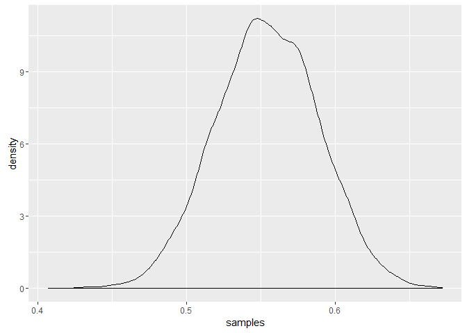

Sampling The Imaginary
================
Tristan Mahr
July 18, 2016

Preamble
--------

This is notebook of code I wrote while reading Chapter 3 of [*Statistical Rethinking*](http://xcelab.net/rm/statistical-rethinking/).

Standard medical testing example
--------------------------------

You have a test to reports whether a patient is a vampire or not.

``` r
# test is very accurate
p_test_given_vampire <- .95

# but false positives happen
p_test_given_mortal <- .01

# vampires are very rare
p_vampire <- .001

# Work out other helpful facts from these
p_mortal <- 1 - p_vampire
p_test <- p_mortal * p_test_given_mortal + p_vampire * p_test_given_vampire
```

Someone takes the test and it says yes. What are the chances that they are a vampire?

We uses Bayes's Theorem. P(Vampire | Test) = P(Test | Vampire) \* P(Vampire) / P(Test)

``` r
p_vampire_given_test <- p_test_given_vampire * p_vampire / p_test
p_vampire_given_test
#> [1] 0.08683729
```

Only an 8.7% chance of being a vampire, given that they tested positive on the test.

But using Bayes's theorem is not the same as Bayesian inference. We could have computed this using frequencies of events.

``` r
# Suppose the test were administered 100,000 times.
n_tested <- 100000
n_mortal <- 99900
n_vampires <- 100
n_vampires_tested_yes <- 95
n_mortals_tested_yes <- 999
```

What are the chances of a yes being a vampire?

``` r
n_vampires_tested_yes / (n_vampires_tested_yes + n_mortals_tested_yes)
#> [1] 0.08683729
95 / (999 + 95)
#> [1] 0.08683729
```

Bayesian inference is about probability over parameters. The parameters here are well-defined.

------------------------------------------------------------------------

Globe tossing example
---------------------

Globe tossed 9 times, and it lands on water 6 times. What is proportion of earth is covered with water on the globe?

Grid approximation of posterior distribribution. Assuming all probabilities are equally likely (`prior`). Try many probability values (`p_grid`) from 0 to 1. Measure the `likelihood` of the data at each probability. Divide by total likelihood to get the posterior probability of each probability in the grid.

``` r
p_grid <- seq(from = 0, to = 1, length.out = 1000)
prior <- rep(1 , 1000)
likelihood <- dbinom(6, size = 9, prob = p_grid)
posterior <- likelihood * prior
posterior <- posterior / sum(posterior)
# Sampling from the posterior
samples <- sample(p_grid, prob = posterior, size = 1e4, replace = TRUE)

plot(samples)
```


``` r
plot(density(samples, adjust = .5))
```


How to find the point with peak density

``` r
# find the point at peak density
dens <- density(samples)
dens
#> 
#> Call:
#>  density.default(x = samples)
#> 
#> Data: samples (10000 obs.);  Bandwidth 'bw' = 0.02012
#> 
#>        x                y           
#>  Min.   :0.1028   Min.   :0.000034  
#>  1st Qu.:0.3357   1st Qu.:0.106075  
#>  Median :0.5686   Median :0.825556  
#>  Mean   :0.5686   Mean   :1.072483  
#>  3rd Qu.:0.8014   3rd Qu.:2.026009  
#>  Max.   :1.0343   Max.   :2.721891
plot(dens)
```


``` r
dens$x[which.max(dens$y)]
#> [1] 0.6679169
```

Practice
--------

### Hard

``` r
library("tibble")
#> Warning: package 'tibble' was built under R version 3.2.5
library("dplyr")
#> Warning: package 'dplyr' was built under R version 3.2.5
#> 
#> Attaching package: 'dplyr'
#> The following objects are masked from 'package:stats':
#> 
#>     filter, lag
#> The following objects are masked from 'package:base':
#> 
#>     intersect, setdiff, setequal, union
library("tidyr")
#> Warning: package 'tidyr' was built under R version 3.2.5
library("ggplot2")
data(homeworkch3, package = "rethinking")

# 100 two-children families. 1: Child is a boy. 0: Girl.
df <- data_frame(
  Family = seq_along(birth1),
  Child1 = birth1,
  Child2 = birth2)
df
#> # A tibble: 100 x 3
#>    Family Child1 Child2
#>     <int>  <dbl>  <dbl>
#> 1       1      1      0
#> 2       2      0      1
#> 3       3      0      0
#> 4       4      0      1
#> 5       5      1      0
#> 6       6      1      1
#> 7       7      0      1
#> 8       8      1      1
#> 9       9      0      0
#> 10     10      1      0
#> # ... with 90 more rows

# Long format better reflects nesting of children in families
df_long <- df %>% 
  rename(`1` = Child1, `2` = Child2) %>% 
  gather(Child, Gender, -Family) %>% 
  readr::type_convert() %>% 
  arrange(Family, Child)
df_long
#> # A tibble: 200 x 3
#>    Family Child Gender
#>     <int> <int>  <dbl>
#> 1       1     1      1
#> 2       1     2      0
#> 3       2     1      0
#> 4       2     2      1
#> 5       3     1      0
#> 6       3     2      0
#> 7       4     1      0
#> 8       4     2      1
#> 9       5     1      1
#> 10      5     2      0
#> # ... with 190 more rows
```

**3H1. Using grid approximation, compute the posterior distribution for the probability of a birth being a boy. Assume a uniform prior probability. Which parameter value maximizes the posterior probability?**

Basically, rework through the globe-tossing grid approximation's code with new data.

``` r
births <- df_long$Gender

p_grid <- seq(from = 0, to = 1, length.out = 1000)
prior <- rep(1 , 1000)

likelihood <- dbinom(sum(births), size = length(births), prob = p_grid)
posterior <- likelihood * prior
posterior <- posterior / sum(posterior)

p_grid[which.max(posterior)]
#> [1] 0.5545546
```

**3H2. Using the `sample` function, draw 10,000 random parameter values from the posterior distribution you calculated above. Use these samples to estimate the 50%, 89%, and 97% highest posterior density intervals.**

``` r
samples <- sample(p_grid, prob = posterior, size = 1e4, replace = TRUE)

ggplot() + geom_density(aes(x = samples))
```



``` r

# HPDI returned in a data-frame with a column for probability level
tidy_hpdi <- function(xs, prob) {
  xs %>% 
    coda::as.mcmc() %>% 
    coda::HPDinterval(prob) %>% 
    as.data.frame %>% 
    rownames_to_column("Variable") %>% 
    as_data_frame() %>% 
    mutate(Level = prob) %>% 
    select(Level, Variable, lower, upper)
}

bind_rows(
  tidy_hpdi(samples, .5),
  tidy_hpdi(samples, .89),
  tidy_hpdi(samples, .97)
)
#> # A tibble: 3 x 4
#>   Level Variable     lower     upper
#>   <dbl>    <chr>     <dbl>     <dbl>
#> 1  0.50     var1 0.5305305 0.5775776
#> 2  0.89     var1 0.5005005 0.6106106
#> 3  0.97     var1 0.4794795 0.6276276
```

**3H3. Use `rbinom` to simulate 10,000 replicates of 200 births. You should end up with 10,000 numbers, each one a count of boys out of 200 births. Compare the distribution of predicted numbers of boys to the actual count in the data (111 boys out of 200 births).**

``` r
replicates <- rbinom(n = length(samples), size = 200, prob = samples)
obs_reps <- replicates[replicates == sum(births)]

ggplot() + 
  geom_histogram(aes(x = replicates), binwidth = 1, color = "white") +
  geom_histogram(aes(x = obs_reps), binwidth = 1, 
                 fill = rethinking::rethink_palette[1], color = "white") + 
  labs(x = "(Simulated) Num Boys in 2-Child Families",
       y = "Frequency in 10,000 Simulations")
```


**3H4. Now compare 10,000 counts of boys from 100 simulated first borns only to the number of boys in the first births, `birth1`. How does the model look in this light?**

The data don't fall squarely in the middle of the simulations. But they fall in 40% HPDI.

``` r
replicates <- rbinom(n = length(samples), size = 100, prob = samples)
obs_reps <- replicates[replicates == sum(birth1)]

ggplot() + 
  geom_histogram(aes(x = replicates), binwidth = 1, color = "white") +
  geom_histogram(aes(x = obs_reps), binwidth = 1, 
                 fill = rethinking::rethink_palette[1], color = "white") + 
  labs(x = "(Simulated) Num Boys in 1-Child Families",
       y = "Frequency in 10,000 Simulations")
```


``` r

sum(df$Child1)
#> [1] 51
tidy_hpdi(replicates, .4)
#> # A tibble: 1 x 4
#>   Level Variable lower upper
#>   <dbl>    <chr> <int> <int>
#> 1   0.4     var1    50    56
```

**3H5. The model assumes that sex of first and second births are independent. To check this assumption, focus now on second births that followed female first borns. Compare 10,000 simulated counts of boys to only those second births that followed girls. To do this correctly, you need to count the number of first borns who were girls and simulate that many births, 10,000 times. Compare the counts of boys in your simulations to the actual observed count of boys following girls. How does the model look in this light? Any guesses what is going on in these data?**

The parents want the second child to be a boy. The number of boys born after girls falls on the extreme edge of the simulations.

``` r
n_girl_birth1 <- sum(birth1 == 0)
n_girl_birth1
#> [1] 49

boys_after_girls <- df %>% 
  filter(Child1 == 0, Child2 == 1) %>% 
  nrow
boys_after_girls
#> [1] 39

replicates <- rbinom(n = length(samples), size = n_girl_birth1, prob = samples)
obs_reps <- replicates[replicates == boys_after_girls]

ggplot() + 
  geom_histogram(aes(x = replicates), binwidth = 1, color = "white") +
  geom_histogram(aes(x = obs_reps), binwidth = 1, 
                 fill = rethinking::rethink_palette[1], color = "white") +
  geom_vline(xintercept = boys_after_girls, 
             color = rethinking::rethink_palette[1]) +
  labs(x = "(Simulated) Num Boys Born after Girls in 2-Child Fams",
       y = "Frequency in 10,000 Simulations")
```


It's possible that they want one of each gender. The number of boys born after girls is also kind of skewed away from the simulations, but nowhere near as extremely. Maybe because some parents are fine with two boys.

``` r
n_boy_birth1 <- sum(birth1 == 1)

girls_after_boys <- df %>% 
  filter(Child1 == 1, Child2 == 0) %>% 
  nrow
girls_after_boys
#> [1] 30

boys_after_boys <- df %>% 
  filter(Child1 == 1, Child2 == 1) %>% 
  nrow
boys_after_boys
#> [1] 21

replicates <- rbinom(n = length(samples), size = n_boy_birth1, prob = samples)
obs_reps <- replicates[replicates == boys_after_boys]

ggplot() + 
  geom_histogram(aes(x = replicates), binwidth = 1, color = "white") +
  geom_histogram(aes(x = obs_reps), binwidth = 1, 
                 fill = rethinking::rethink_palette[1], color = "white") +
  geom_vline(xintercept = boys_after_boys, 
             color = rethinking::rethink_palette[1]) +
  labs(x = "(Simulated) Num Boys Born after Boys in 2-Child Fams",
       y = "Frequency in 10,000 Simulations")
```


``` r
df %>% count(Child1, Child2)
#> Source: local data frame [4 x 3]
#> Groups: Child1 [?]
#> 
#>   Child1 Child2     n
#>    <dbl>  <dbl> <int>
#> 1      0      0    10
#> 2      0      1    39
#> 3      1      0    30
#> 4      1      1    21
```
