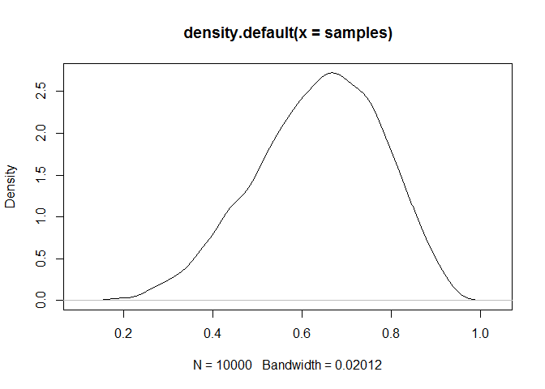

Sampling The Imaginary
================
Tristan Mahr
July 18, 2016

Preamble
--------

This is notebook of code I wrote while reading Chapter 3 of [*Statistical Rethinking*](http://xcelab.net/rm/statistical-rethinking/).

Standard medical testing example
--------------------------------

You have a test to reports whether a patient is a vampire or not.

``` r
# test is very accurate
p_test_given_vampire <- .95

# but false positives happen
p_test_given_mortal <- .01

# vampires are very rare
p_vampire <- .001

# Work out other helpful facts from these
p_mortal <- 1 - p_vampire
p_test <- p_mortal * p_test_given_mortal + p_vampire * p_test_given_vampire
```

Someone takes the test and it says yes. What are the chances that they are a vampire?

We uses Bayes's Theorem. P(Vampire | Test) = P(Test | Vampire) \* P(Vampire) / P(Test)

``` r
p_vampire_given_test <- p_test_given_vampire * p_vampire / p_test
p_vampire_given_test
#> [1] 0.08683729
```

Only an 8.7% chance of being a vampire, given that they tested positive on the test.

But using Bayes's theorem is not the same as Bayesian inference. We could have computed this using frequencies of events.

``` r
# Suppose the test were administered 100,000 times.
n_tested <- 100000
n_mortal <- 99900
n_vampires <- 100
n_vampires_tested_yes <- 95
n_mortals_tested_yes <- 999
```

What are the chances of a yes being a vampire?

``` r
n_vampires_tested_yes / (n_vampires_tested_yes + n_mortals_tested_yes)
#> [1] 0.08683729
95 / (999 + 95)
#> [1] 0.08683729
```

Bayesian inference is about probability over parameters. The parameters here are well-defined.

------------------------------------------------------------------------

Globe tossing example
---------------------

Globe tossed 9 times, and it lands on water 6 times. What is proportion of earth is covered with water on the globe?

Grid approximation of posterior distribribution. Assuming all probabilities are equally likely (`prior`). Try many probability values (`p_grid`) from 0 to 1. Measure the `likelihood` of the data at each probability. Divide by total likelihood to get the posterior probability of each probability in the grid.

``` r
p_grid <- seq(from = 0, to = 1, length.out = 1000)
prior <- rep(1 , 1000)
likelihood <- dbinom(6, size = 9, prob = p_grid)
posterior <- likelihood * prior
posterior <- posterior / sum(posterior)
# Sampling from the posterior
samples <- sample(p_grid, prob = posterior, size = 1e4, replace = TRUE)

plot(samples)
```


``` r
plot(density(samples, adjust = .5))
```


How to find the point with peak density

``` r
# find the point at peak density
dens <- density(samples)
dens
#> 
#> Call:
#>  density.default(x = samples)
#> 
#> Data: samples (10000 obs.);  Bandwidth 'bw' = 0.01965
#> 
#>        x                y            
#>  Min.   :0.1012   Min.   :0.0000239  
#>  1st Qu.:0.3354   1st Qu.:0.0825700  
#>  Median :0.5696   Median :0.7681021  
#>  Mean   :0.5696   Mean   :1.0665385  
#>  3rd Qu.:0.8037   3rd Qu.:1.9894292  
#>  Max.   :1.0379   Max.   :2.7763942
plot(dens)
```



``` r
dens$x[which.max(dens$y)]
#> [1] 0.6584733
```
