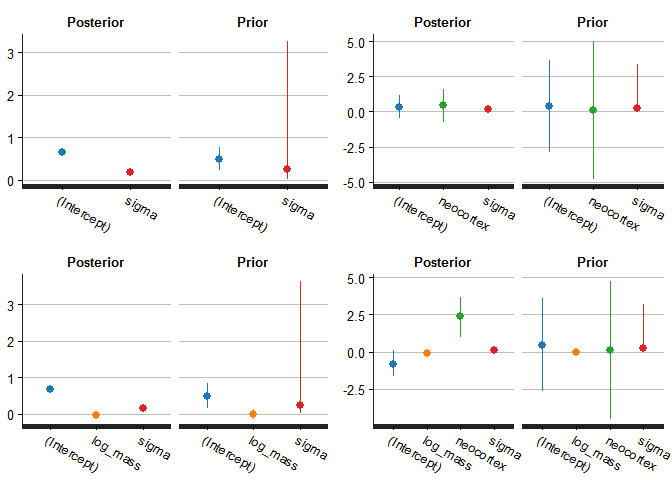

06 - Information Criteria
================
TJ Mahr
June 29, 2016

Preamble
--------

This is notebook of code I wrote while reading Chapter 6 of [*Statistical Rethinking*](http://xcelab.net/rm/statistical-rethinking/). I don't use the author's [rethinking package](https://github.com/rmcelreath/rethinking) or any of its helper functions. I instead used [RStanARM](http://mc-stan.org/%20interfaces/rstanarm) to fit the Bayesian models and [Loo](http://mc-stan.org/%20interfaces/loo.html) for model comparisons, because I'm trying to stay in that ecosystem. As a result, my models have different priors and different parameter estimates.

``` r
# devtools::install_github("rmcelreath/rethinking")
library("dplyr", warn.conflicts = FALSE)
#> Warning: package 'dplyr' was built under R version 3.3.1
library("rstanarm")
#> Warning: package 'rstanarm' was built under R version 3.3.1
#> Loading required package: Rcpp
#> rstanarm (Version 2.10.1, packaged: 2016-06-24 17:54:22 UTC)
#> - Do not expect the default priors to remain the same in future rstanarm versions.
#> Thus, R scripts should specify priors explicitly, even if they are just the defaults.
#> - For execution on a local, multicore CPU with excess RAM we recommend calling
#> options(mc.cores = parallel::detectCores())
library("purrr")
#> 
#> Attaching package: 'purrr'
#> The following objects are masked from 'package:dplyr':
#> 
#>     contains, order_by
library("tidyr")
library("ggplot2")

# I don't load the rethinking package, but I use data from it. Log version.
rethinking_info <- packageDescription(
  pkg = "rethinking", 
  fields = c("Version", "GithubUsername", "GithubRepo", 
             "GithubRef", "GithubSHA1"))
str(rethinking_info, give.attr = FALSE)
#> List of 5
#>  $ Version       : chr "1.59"
#>  $ GithubUsername: chr "rmcelreath"
#>  $ GithubRepo    : chr "rethinking"
#>  $ GithubRef     : chr "master"
#>  $ GithubSHA1    : chr "a309712d904d1db7af1e08a76c521ab994006fd5"
```

Prepare the data
----------------

Get the primate milk data. The example models will predict the kilocalories per gram of milk using the mass of the mother (log kg) and the proportion of the brain that is neocortex. These data are from Hinde and Milligan (2011), according to `?milk`.

``` r
data(milk, package = "rethinking")
d <- milk %>% 
  as_data_frame %>% 
  filter(!is.na(neocortex.perc)) %>% 
  mutate(neocortex = neocortex.perc / 100,
         log_mass = log(mass)) %>% 
  select(clade, species, kcal.per.g, mass, log_mass, neocortex)
d %>% knitr::kable(digits = 3)
```

| clade            | species                 |  kcal.per.g|   mass|  log\_mass|  neocortex|
|:-----------------|:------------------------|-----------:|------:|----------:|----------:|
| Strepsirrhine    | Eulemur fulvus          |        0.49|   1.95|      0.668|      0.552|
| New World Monkey | Alouatta seniculus      |        0.47|   5.25|      1.658|      0.645|
| New World Monkey | A palliata              |        0.56|   5.37|      1.681|      0.645|
| New World Monkey | Cebus apella            |        0.89|   2.51|      0.920|      0.676|
| New World Monkey | S sciureus              |        0.92|   0.68|     -0.386|      0.688|
| New World Monkey | Cebuella pygmaea        |        0.80|   0.12|     -2.120|      0.588|
| New World Monkey | Callimico goeldii       |        0.46|   0.47|     -0.755|      0.617|
| New World Monkey | Callithrix jacchus      |        0.71|   0.32|     -1.139|      0.603|
| Old World Monkey | Miopithecus talpoin     |        0.68|   1.55|      0.438|      0.700|
| Old World Monkey | M mulatta               |        0.97|   3.24|      1.176|      0.704|
| Old World Monkey | Papio spp               |        0.84|  12.30|      2.510|      0.734|
| Ape              | Hylobates lar           |        0.62|   5.37|      1.681|      0.675|
| Ape              | Pongo pygmaeus          |        0.54|  35.48|      3.569|      0.713|
| Ape              | Gorilla gorilla gorilla |        0.49|  79.43|      4.375|      0.726|
| Ape              | Pan paniscus            |        0.48|  40.74|      3.707|      0.702|
| Ape              | P troglodytes           |        0.55|  33.11|      3.500|      0.763|
| Ape              | Homo sapiens            |        0.71|  54.95|      4.006|      0.755|

Fit the models
--------------

Fit four different models that we will compare later.

``` r
# Intercept only
m1 <- stan_glm(
  formula = kcal.per.g ~ 1,
  data = d,
  family = gaussian(),
  prior = normal(0, 1),
  prior_intercept = normal(.5, .5),
  prior_ops = prior_options(prior_scale_for_dispersion = .25)
)
#> 
#> SAMPLING FOR MODEL 'continuous' NOW (CHAIN 1).
#> 
#> Chain 1, Iteration:    1 / 2000 [  0%]  (Warmup)
#> Chain 1, Iteration:  200 / 2000 [ 10%]  (Warmup)
#> Chain 1, Iteration:  400 / 2000 [ 20%]  (Warmup)
#> Chain 1, Iteration:  600 / 2000 [ 30%]  (Warmup)
#> Chain 1, Iteration:  800 / 2000 [ 40%]  (Warmup)
#> Chain 1, Iteration: 1000 / 2000 [ 50%]  (Warmup)
#> Chain 1, Iteration: 1001 / 2000 [ 50%]  (Sampling)
#> Chain 1, Iteration: 1200 / 2000 [ 60%]  (Sampling)
#> Chain 1, Iteration: 1400 / 2000 [ 70%]  (Sampling)
#> Chain 1, Iteration: 1600 / 2000 [ 80%]  (Sampling)
#> Chain 1, Iteration: 1800 / 2000 [ 90%]  (Sampling)
#> Chain 1, Iteration: 2000 / 2000 [100%]  (Sampling)
#>  Elapsed Time: 0.021 seconds (Warm-up)
#>                0.028 seconds (Sampling)
#>                0.049 seconds (Total)
#> 
#> 
#> SAMPLING FOR MODEL 'continuous' NOW (CHAIN 2).
#> 
#> Chain 2, Iteration:    1 / 2000 [  0%]  (Warmup)
#> Chain 2, Iteration:  200 / 2000 [ 10%]  (Warmup)
#> Chain 2, Iteration:  400 / 2000 [ 20%]  (Warmup)
#> Chain 2, Iteration:  600 / 2000 [ 30%]  (Warmup)
#> Chain 2, Iteration:  800 / 2000 [ 40%]  (Warmup)
#> Chain 2, Iteration: 1000 / 2000 [ 50%]  (Warmup)
#> Chain 2, Iteration: 1001 / 2000 [ 50%]  (Sampling)
#> Chain 2, Iteration: 1200 / 2000 [ 60%]  (Sampling)
#> Chain 2, Iteration: 1400 / 2000 [ 70%]  (Sampling)
#> Chain 2, Iteration: 1600 / 2000 [ 80%]  (Sampling)
#> Chain 2, Iteration: 1800 / 2000 [ 90%]  (Sampling)
#> Chain 2, Iteration: 2000 / 2000 [100%]  (Sampling)
#>  Elapsed Time: 0.02 seconds (Warm-up)
#>                0.025 seconds (Sampling)
#>                0.045 seconds (Total)
#> 
#> 
#> SAMPLING FOR MODEL 'continuous' NOW (CHAIN 3).
#> 
#> Chain 3, Iteration:    1 / 2000 [  0%]  (Warmup)
#> Chain 3, Iteration:  200 / 2000 [ 10%]  (Warmup)
#> Chain 3, Iteration:  400 / 2000 [ 20%]  (Warmup)
#> Chain 3, Iteration:  600 / 2000 [ 30%]  (Warmup)
#> Chain 3, Iteration:  800 / 2000 [ 40%]  (Warmup)
#> Chain 3, Iteration: 1000 / 2000 [ 50%]  (Warmup)
#> Chain 3, Iteration: 1001 / 2000 [ 50%]  (Sampling)
#> Chain 3, Iteration: 1200 / 2000 [ 60%]  (Sampling)
#> Chain 3, Iteration: 1400 / 2000 [ 70%]  (Sampling)
#> Chain 3, Iteration: 1600 / 2000 [ 80%]  (Sampling)
#> Chain 3, Iteration: 1800 / 2000 [ 90%]  (Sampling)
#> Chain 3, Iteration: 2000 / 2000 [100%]  (Sampling)
#>  Elapsed Time: 0.021 seconds (Warm-up)
#>                0.025 seconds (Sampling)
#>                0.046 seconds (Total)
#> 
#> 
#> SAMPLING FOR MODEL 'continuous' NOW (CHAIN 4).
#> 
#> Chain 4, Iteration:    1 / 2000 [  0%]  (Warmup)
#> Chain 4, Iteration:  200 / 2000 [ 10%]  (Warmup)
#> Chain 4, Iteration:  400 / 2000 [ 20%]  (Warmup)
#> Chain 4, Iteration:  600 / 2000 [ 30%]  (Warmup)
#> Chain 4, Iteration:  800 / 2000 [ 40%]  (Warmup)
#> Chain 4, Iteration: 1000 / 2000 [ 50%]  (Warmup)
#> Chain 4, Iteration: 1001 / 2000 [ 50%]  (Sampling)
#> Chain 4, Iteration: 1200 / 2000 [ 60%]  (Sampling)
#> Chain 4, Iteration: 1400 / 2000 [ 70%]  (Sampling)
#> Chain 4, Iteration: 1600 / 2000 [ 80%]  (Sampling)
#> Chain 4, Iteration: 1800 / 2000 [ 90%]  (Sampling)
#> Chain 4, Iteration: 2000 / 2000 [100%]  (Sampling)
#>  Elapsed Time: 0.02 seconds (Warm-up)
#>                0.023 seconds (Sampling)
#>                0.043 seconds (Total)

# One predictor
m2 <- update(m1, . ~ neocortex)
#> 
#> SAMPLING FOR MODEL 'continuous' NOW (CHAIN 1).
#> 
#> Chain 1, Iteration:    1 / 2000 [  0%]  (Warmup)
#> Chain 1, Iteration:  200 / 2000 [ 10%]  (Warmup)
#> Chain 1, Iteration:  400 / 2000 [ 20%]  (Warmup)
#> Chain 1, Iteration:  600 / 2000 [ 30%]  (Warmup)
#> Chain 1, Iteration:  800 / 2000 [ 40%]  (Warmup)
#> Chain 1, Iteration: 1000 / 2000 [ 50%]  (Warmup)
#> Chain 1, Iteration: 1001 / 2000 [ 50%]  (Sampling)
#> Chain 1, Iteration: 1200 / 2000 [ 60%]  (Sampling)
#> Chain 1, Iteration: 1400 / 2000 [ 70%]  (Sampling)
#> Chain 1, Iteration: 1600 / 2000 [ 80%]  (Sampling)
#> Chain 1, Iteration: 1800 / 2000 [ 90%]  (Sampling)
#> Chain 1, Iteration: 2000 / 2000 [100%]  (Sampling)
#>  Elapsed Time: 0.042 seconds (Warm-up)
#>                0.044 seconds (Sampling)
#>                0.086 seconds (Total)
#> 
#> 
#> SAMPLING FOR MODEL 'continuous' NOW (CHAIN 2).
#> 
#> Chain 2, Iteration:    1 / 2000 [  0%]  (Warmup)
#> Chain 2, Iteration:  200 / 2000 [ 10%]  (Warmup)
#> Chain 2, Iteration:  400 / 2000 [ 20%]  (Warmup)
#> Chain 2, Iteration:  600 / 2000 [ 30%]  (Warmup)
#> Chain 2, Iteration:  800 / 2000 [ 40%]  (Warmup)
#> Chain 2, Iteration: 1000 / 2000 [ 50%]  (Warmup)
#> Chain 2, Iteration: 1001 / 2000 [ 50%]  (Sampling)
#> Chain 2, Iteration: 1200 / 2000 [ 60%]  (Sampling)
#> Chain 2, Iteration: 1400 / 2000 [ 70%]  (Sampling)
#> Chain 2, Iteration: 1600 / 2000 [ 80%]  (Sampling)
#> Chain 2, Iteration: 1800 / 2000 [ 90%]  (Sampling)
#> Chain 2, Iteration: 2000 / 2000 [100%]  (Sampling)
#>  Elapsed Time: 0.042 seconds (Warm-up)
#>                0.047 seconds (Sampling)
#>                0.089 seconds (Total)
#> 
#> 
#> SAMPLING FOR MODEL 'continuous' NOW (CHAIN 3).
#> 
#> Chain 3, Iteration:    1 / 2000 [  0%]  (Warmup)
#> Chain 3, Iteration:  200 / 2000 [ 10%]  (Warmup)
#> Chain 3, Iteration:  400 / 2000 [ 20%]  (Warmup)
#> Chain 3, Iteration:  600 / 2000 [ 30%]  (Warmup)
#> Chain 3, Iteration:  800 / 2000 [ 40%]  (Warmup)
#> Chain 3, Iteration: 1000 / 2000 [ 50%]  (Warmup)
#> Chain 3, Iteration: 1001 / 2000 [ 50%]  (Sampling)
#> Chain 3, Iteration: 1200 / 2000 [ 60%]  (Sampling)
#> Chain 3, Iteration: 1400 / 2000 [ 70%]  (Sampling)
#> Chain 3, Iteration: 1600 / 2000 [ 80%]  (Sampling)
#> Chain 3, Iteration: 1800 / 2000 [ 90%]  (Sampling)
#> Chain 3, Iteration: 2000 / 2000 [100%]  (Sampling)
#>  Elapsed Time: 0.044 seconds (Warm-up)
#>                0.04 seconds (Sampling)
#>                0.084 seconds (Total)
#> 
#> 
#> SAMPLING FOR MODEL 'continuous' NOW (CHAIN 4).
#> 
#> Chain 4, Iteration:    1 / 2000 [  0%]  (Warmup)
#> Chain 4, Iteration:  200 / 2000 [ 10%]  (Warmup)
#> Chain 4, Iteration:  400 / 2000 [ 20%]  (Warmup)
#> Chain 4, Iteration:  600 / 2000 [ 30%]  (Warmup)
#> Chain 4, Iteration:  800 / 2000 [ 40%]  (Warmup)
#> Chain 4, Iteration: 1000 / 2000 [ 50%]  (Warmup)
#> Chain 4, Iteration: 1001 / 2000 [ 50%]  (Sampling)
#> Chain 4, Iteration: 1200 / 2000 [ 60%]  (Sampling)
#> Chain 4, Iteration: 1400 / 2000 [ 70%]  (Sampling)
#> Chain 4, Iteration: 1600 / 2000 [ 80%]  (Sampling)
#> Chain 4, Iteration: 1800 / 2000 [ 90%]  (Sampling)
#> Chain 4, Iteration: 2000 / 2000 [100%]  (Sampling)
#>  Elapsed Time: 0.042 seconds (Warm-up)
#>                0.046 seconds (Sampling)
#>                0.088 seconds (Total)
m3 <- update(m1, . ~ log_mass)
#> 
#> SAMPLING FOR MODEL 'continuous' NOW (CHAIN 1).
#> 
#> Chain 1, Iteration:    1 / 2000 [  0%]  (Warmup)
#> Chain 1, Iteration:  200 / 2000 [ 10%]  (Warmup)
#> Chain 1, Iteration:  400 / 2000 [ 20%]  (Warmup)
#> Chain 1, Iteration:  600 / 2000 [ 30%]  (Warmup)
#> Chain 1, Iteration:  800 / 2000 [ 40%]  (Warmup)
#> Chain 1, Iteration: 1000 / 2000 [ 50%]  (Warmup)
#> Chain 1, Iteration: 1001 / 2000 [ 50%]  (Sampling)
#> Chain 1, Iteration: 1200 / 2000 [ 60%]  (Sampling)
#> Chain 1, Iteration: 1400 / 2000 [ 70%]  (Sampling)
#> Chain 1, Iteration: 1600 / 2000 [ 80%]  (Sampling)
#> Chain 1, Iteration: 1800 / 2000 [ 90%]  (Sampling)
#> Chain 1, Iteration: 2000 / 2000 [100%]  (Sampling)
#>  Elapsed Time: 0.094 seconds (Warm-up)
#>                0.083 seconds (Sampling)
#>                0.177 seconds (Total)
#> 
#> 
#> SAMPLING FOR MODEL 'continuous' NOW (CHAIN 2).
#> 
#> Chain 2, Iteration:    1 / 2000 [  0%]  (Warmup)
#> Chain 2, Iteration:  200 / 2000 [ 10%]  (Warmup)
#> Chain 2, Iteration:  400 / 2000 [ 20%]  (Warmup)
#> Chain 2, Iteration:  600 / 2000 [ 30%]  (Warmup)
#> Chain 2, Iteration:  800 / 2000 [ 40%]  (Warmup)
#> Chain 2, Iteration: 1000 / 2000 [ 50%]  (Warmup)
#> Chain 2, Iteration: 1001 / 2000 [ 50%]  (Sampling)
#> Chain 2, Iteration: 1200 / 2000 [ 60%]  (Sampling)
#> Chain 2, Iteration: 1400 / 2000 [ 70%]  (Sampling)
#> Chain 2, Iteration: 1600 / 2000 [ 80%]  (Sampling)
#> Chain 2, Iteration: 1800 / 2000 [ 90%]  (Sampling)
#> Chain 2, Iteration: 2000 / 2000 [100%]  (Sampling)
#>  Elapsed Time: 0.087 seconds (Warm-up)
#>                0.08 seconds (Sampling)
#>                0.167 seconds (Total)
#> 
#> 
#> SAMPLING FOR MODEL 'continuous' NOW (CHAIN 3).
#> 
#> Chain 3, Iteration:    1 / 2000 [  0%]  (Warmup)
#> Chain 3, Iteration:  200 / 2000 [ 10%]  (Warmup)
#> Chain 3, Iteration:  400 / 2000 [ 20%]  (Warmup)
#> Chain 3, Iteration:  600 / 2000 [ 30%]  (Warmup)
#> Chain 3, Iteration:  800 / 2000 [ 40%]  (Warmup)
#> Chain 3, Iteration: 1000 / 2000 [ 50%]  (Warmup)
#> Chain 3, Iteration: 1001 / 2000 [ 50%]  (Sampling)
#> Chain 3, Iteration: 1200 / 2000 [ 60%]  (Sampling)
#> Chain 3, Iteration: 1400 / 2000 [ 70%]  (Sampling)
#> Chain 3, Iteration: 1600 / 2000 [ 80%]  (Sampling)
#> Chain 3, Iteration: 1800 / 2000 [ 90%]  (Sampling)
#> Chain 3, Iteration: 2000 / 2000 [100%]  (Sampling)
#>  Elapsed Time: 0.089 seconds (Warm-up)
#>                0.071 seconds (Sampling)
#>                0.16 seconds (Total)
#> 
#> 
#> SAMPLING FOR MODEL 'continuous' NOW (CHAIN 4).
#> 
#> Chain 4, Iteration:    1 / 2000 [  0%]  (Warmup)
#> Chain 4, Iteration:  200 / 2000 [ 10%]  (Warmup)
#> Chain 4, Iteration:  400 / 2000 [ 20%]  (Warmup)
#> Chain 4, Iteration:  600 / 2000 [ 30%]  (Warmup)
#> Chain 4, Iteration:  800 / 2000 [ 40%]  (Warmup)
#> Chain 4, Iteration: 1000 / 2000 [ 50%]  (Warmup)
#> Chain 4, Iteration: 1001 / 2000 [ 50%]  (Sampling)
#> Chain 4, Iteration: 1200 / 2000 [ 60%]  (Sampling)
#> Chain 4, Iteration: 1400 / 2000 [ 70%]  (Sampling)
#> Chain 4, Iteration: 1600 / 2000 [ 80%]  (Sampling)
#> Chain 4, Iteration: 1800 / 2000 [ 90%]  (Sampling)
#> Chain 4, Iteration: 2000 / 2000 [100%]  (Sampling)
#>  Elapsed Time: 0.104 seconds (Warm-up)
#>                0.081 seconds (Sampling)
#>                0.185 seconds (Total)

# Two predictors
m4 <- update(m1, . ~ neocortex + log_mass)
#> 
#> SAMPLING FOR MODEL 'continuous' NOW (CHAIN 1).
#> 
#> Chain 1, Iteration:    1 / 2000 [  0%]  (Warmup)
#> Chain 1, Iteration:  200 / 2000 [ 10%]  (Warmup)
#> Chain 1, Iteration:  400 / 2000 [ 20%]  (Warmup)
#> Chain 1, Iteration:  600 / 2000 [ 30%]  (Warmup)
#> Chain 1, Iteration:  800 / 2000 [ 40%]  (Warmup)
#> Chain 1, Iteration: 1000 / 2000 [ 50%]  (Warmup)
#> Chain 1, Iteration: 1001 / 2000 [ 50%]  (Sampling)
#> Chain 1, Iteration: 1200 / 2000 [ 60%]  (Sampling)
#> Chain 1, Iteration: 1400 / 2000 [ 70%]  (Sampling)
#> Chain 1, Iteration: 1600 / 2000 [ 80%]  (Sampling)
#> Chain 1, Iteration: 1800 / 2000 [ 90%]  (Sampling)
#> Chain 1, Iteration: 2000 / 2000 [100%]  (Sampling)
#>  Elapsed Time: 0.074 seconds (Warm-up)
#>                0.068 seconds (Sampling)
#>                0.142 seconds (Total)
#> 
#> 
#> SAMPLING FOR MODEL 'continuous' NOW (CHAIN 2).
#> 
#> Chain 2, Iteration:    1 / 2000 [  0%]  (Warmup)
#> Chain 2, Iteration:  200 / 2000 [ 10%]  (Warmup)
#> Chain 2, Iteration:  400 / 2000 [ 20%]  (Warmup)
#> Chain 2, Iteration:  600 / 2000 [ 30%]  (Warmup)
#> Chain 2, Iteration:  800 / 2000 [ 40%]  (Warmup)
#> Chain 2, Iteration: 1000 / 2000 [ 50%]  (Warmup)
#> Chain 2, Iteration: 1001 / 2000 [ 50%]  (Sampling)
#> Chain 2, Iteration: 1200 / 2000 [ 60%]  (Sampling)
#> Chain 2, Iteration: 1400 / 2000 [ 70%]  (Sampling)
#> Chain 2, Iteration: 1600 / 2000 [ 80%]  (Sampling)
#> Chain 2, Iteration: 1800 / 2000 [ 90%]  (Sampling)
#> Chain 2, Iteration: 2000 / 2000 [100%]  (Sampling)
#>  Elapsed Time: 0.064 seconds (Warm-up)
#>                0.056 seconds (Sampling)
#>                0.12 seconds (Total)
#> 
#> 
#> SAMPLING FOR MODEL 'continuous' NOW (CHAIN 3).
#> 
#> Chain 3, Iteration:    1 / 2000 [  0%]  (Warmup)
#> Chain 3, Iteration:  200 / 2000 [ 10%]  (Warmup)
#> Chain 3, Iteration:  400 / 2000 [ 20%]  (Warmup)
#> Chain 3, Iteration:  600 / 2000 [ 30%]  (Warmup)
#> Chain 3, Iteration:  800 / 2000 [ 40%]  (Warmup)
#> Chain 3, Iteration: 1000 / 2000 [ 50%]  (Warmup)
#> Chain 3, Iteration: 1001 / 2000 [ 50%]  (Sampling)
#> Chain 3, Iteration: 1200 / 2000 [ 60%]  (Sampling)
#> Chain 3, Iteration: 1400 / 2000 [ 70%]  (Sampling)
#> Chain 3, Iteration: 1600 / 2000 [ 80%]  (Sampling)
#> Chain 3, Iteration: 1800 / 2000 [ 90%]  (Sampling)
#> Chain 3, Iteration: 2000 / 2000 [100%]  (Sampling)
#>  Elapsed Time: 0.065 seconds (Warm-up)
#>                0.058 seconds (Sampling)
#>                0.123 seconds (Total)
#> 
#> 
#> SAMPLING FOR MODEL 'continuous' NOW (CHAIN 4).
#> 
#> Chain 4, Iteration:    1 / 2000 [  0%]  (Warmup)
#> Chain 4, Iteration:  200 / 2000 [ 10%]  (Warmup)
#> Chain 4, Iteration:  400 / 2000 [ 20%]  (Warmup)
#> Chain 4, Iteration:  600 / 2000 [ 30%]  (Warmup)
#> Chain 4, Iteration:  800 / 2000 [ 40%]  (Warmup)
#> Chain 4, Iteration: 1000 / 2000 [ 50%]  (Warmup)
#> Chain 4, Iteration: 1001 / 2000 [ 50%]  (Sampling)
#> Chain 4, Iteration: 1200 / 2000 [ 60%]  (Sampling)
#> Chain 4, Iteration: 1400 / 2000 [ 70%]  (Sampling)
#> Chain 4, Iteration: 1600 / 2000 [ 80%]  (Sampling)
#> Chain 4, Iteration: 1800 / 2000 [ 90%]  (Sampling)
#> Chain 4, Iteration: 2000 / 2000 [100%]  (Sampling)
#>  Elapsed Time: 0.063 seconds (Warm-up)
#>                0.057 seconds (Sampling)
#>                0.12 seconds (Total)
```

Compare posterior to prior in each model.

``` r
# We want to have the same color-parameter mapping across plots, otherwise the
# sigma term will have three different colors. Manually set colors, using the D3
# color palette
d3_colors <- c("#1f77b4", "#ff7f0e", "#2ca02c", "#d62728", "#9467bd", 
               "#8c564b", "#e377c2", "#7f7f7f", "#bcbd22", "#17becf")
p1 <- posterior_vs_prior(m1) + scale_color_manual(values = d3_colors[c(1, 4)])
#> 
#> Drawing from prior...
#> 
#>  Elapsed Time: 0.021 seconds (Warm-up)
#>                0.024 seconds (Sampling)
#>                0.045 seconds (Total)
#> 
#> 
#>  Elapsed Time: 0.021 seconds (Warm-up)
#>                0.024 seconds (Sampling)
#>                0.045 seconds (Total)
p2 <- posterior_vs_prior(m2) + scale_color_manual(values = d3_colors[c(1, 3:4)])
#> 
#> Drawing from prior...
#> 
#>  Elapsed Time: 0.045 seconds (Warm-up)
#>                0.049 seconds (Sampling)
#>                0.094 seconds (Total)
#> 
#> 
#>  Elapsed Time: 0.043 seconds (Warm-up)
#>                0.046 seconds (Sampling)
#>                0.089 seconds (Total)
p3 <- posterior_vs_prior(m3) + scale_color_manual(values = d3_colors[c(1:2, 4)])
#> 
#> Drawing from prior...
#> 
#>  Elapsed Time: 0.058 seconds (Warm-up)
#>                0.062 seconds (Sampling)
#>                0.12 seconds (Total)
#> 
#> 
#>  Elapsed Time: 0.052 seconds (Warm-up)
#>                0.05 seconds (Sampling)
#>                0.102 seconds (Total)
p4 <- posterior_vs_prior(m4) + scale_color_manual(values = d3_colors[c(1:4)])
#> 
#> Drawing from prior...
#> 
#>  Elapsed Time: 0.051 seconds (Warm-up)
#>                0.046 seconds (Sampling)
#>                0.097 seconds (Total)
#> 
#> 
#>  Elapsed Time: 0.052 seconds (Warm-up)
#>                0.043 seconds (Sampling)
#>                0.095 seconds (Total)
cowplot::plot_grid(p1, p2, p3, p4)
```



Manual AIC calculation
----------------------

Deviance measures relative model fit using the log-likelihood of the data. The information criteria adjust the deviance to make a prediction about the model's deviance given some new out-of-sample data. These information criterion therefore estimate a model's relative predictive accurary.

To figure out what the information criteria are measuring, I want to calculate them by hand. The AIC works on classical models, so I wrote a helper function to convert an RStanArm glm model into a classical glm model.

``` r
# Refit a stanreg model using glm. Assumes no other glm arguments are used 
# besides formula, data and family--i.e., this is doesn't work for all glm
# models.
as_glm <- function(stan_model) {
  glm(stan_model$formula, data = stan_model$data, family = stan_model$family)
}

glm_m4 <- as_glm(m4)
```

Plus, another helper to get the maximum likelihood estimate of the model's sigma term.

``` r
# Get the maximum likelihood estimate of sigma from a model
# http://stats.stackexchange.com/a/73245
# https://stat.ethz.ch/pipermail/r-help/2003-June/035518.html
sigma_ml <- function(m) {
  squared_errors <- residuals(m) ^ 2
  sqrt(mean(squared_errors))
}
```

According to our model, each observation falls on a normal curve with a mean equal to fitted value, and a standard deviation equal to model sigma. The density of the fitted-value curve at the observed value is the likelihood of the data.

To compute the likelihood of each observation, we find the density of observations on their fitted-value curves. These are three such densities from model 4. (Code omitted because it's hairy base-graphics code built from the example code in `?dnorm`.)


The sum of the log of the likelihoods is therefore the log-likelihood of a model.

``` r
# By hand calculation
log_likelihoods <- dnorm(
  x = glm_m4$y, 
  mean = glm_m4$fitted.values, 
  sd = sigma_ml(glm_m4), 
  log = TRUE)
log_likelihoods
#>           1           2           3           4           5           6 
#>  0.87397004  0.95498445  1.24492865  0.08700352  1.16873143  1.19341071 
#>           7           8           9          10          11          12 
#> -1.13692008  1.24573233  0.42789805 -0.30246193  0.72560506  1.23223891 
#>          13          14          15          16          17 
#>  1.22896834  1.20983370  1.18740026  0.29284919  1.04353561

sum(log_likelihoods)
#> [1] 12.67771

# Automatic calculation
logLik(glm_m4)
#> 'log Lik.' 12.67771 (df=4)

# Because residuals have mean 0, we can just use those instead of fitted values
dnorm(resid(glm_m4), mean = 0, sd = sigma_ml(glm_m4), log = TRUE) %>% sum
#> [1] 12.67771
```

From the log-likelihood, we can compute deviance, AIC, and BIC.

``` r
# as.numeric to get rid of df attribute
deviance_m4 <- as.numeric(-2 * logLik(glm_m4))
npars_m4 <- attr(logLik(glm_m4), "df")

deviance_m4
#> [1] -25.35542
```

The information criteria are the deviance measures plus some penalty *k* times the number of parameters. For AIC, the penalty is *k*=2. For BIC, the penalty is the log of the number of observations, *k*=log(*n*). The penalty adjusts the in- sample deviance to get predicted value of the out-of-sample deviance. The model with the lowest predicted out-of-sample deviance is the favored model.

``` r
# Manual AIC vs automatic
aic_m4 <- deviance_m4 + 2 * npars_m4
aic_m4
#> [1] -17.35542

AIC(glm_m4)  
#> [1] -17.35542

# Manual BIC vs automatic  
bic_m4 <- deviance_m4 + log(nobs(glm_m4)) * npars_m4
bic_m4
#> [1] -14.02256

BIC(glm_m4)
#> [1] -14.02256
```

Manual WAIC calculation
-----------------------

The above AIC example measured one log-likelihood based on one set of parameters. Our Bayesian model reflects a distribution of parameter estimates, and we sampled thousands of parameter estimates from the posterior distribution. As a result, we have a distribution of log-likelihoods, and posterior information criteria will incorporate information from the distribution of log-likelihoods.

The WAIC (Widely Applicable Information Criterion) is calculated using pointwise log-likelihoods. Specifically, we calculate the log-pointwise-predictive density (lppd). We observation has its own likelihood in each model, so we calculate each observation's average likelihood across models and take the log.

RStanARM provides a `log_lik` to get an n\_samples x n\_observations matrix of log-likelihoods.

``` r
dim(log_lik(m4))
#> [1] 4000   17

# log-pointwise-predictive density as the log of the average
# likelihood of each oberservation
each_lppd <- log_lik(m4) %>% exp %>% colMeans %>% log 
each_lppd
#>  [1]  0.80569857  0.79391889  1.04745275  0.09474761  0.85108037
#>  [6]  0.91072738 -0.38648017  1.01269419  0.64626088 -0.25505588
#> [11]  0.56958283  1.06095646  1.01818995  0.96596231  0.95877792
#> [16]  0.48165390  0.85905590
```

We also need a penalty term. Here, it's the effective number of parameters (p\_waic). Each observation contributes to the penalty term, using the variance of its log-likelihoods.

``` r
# effective number of parameters by taking variance of log-likelihood of each
# observation 
each_p_waic <- log_lik(m4) %>% apply(2, var)
each_p_waic
#>  [1] 0.25980875 0.07067864 0.04352324 0.15433978 0.12202764 0.10803487
#>  [7] 0.76139843 0.05412125 0.13698848 0.34833997 0.12097157 0.03889607
#> [13] 0.04813928 0.06937805 0.06396749 0.22767460 0.09137604
```

The WAIC is the difference in total lppd and total p\_waic on the deviance scale.

``` r
lppd <- sum(each_lppd)
lppd
#> [1] 11.43522
p_waic <- sum(each_p_waic)
p_waic
#> [1] 2.719664
waic <- -2 * (lppd - p_waic)
waic
#> [1] -17.43112

# skip the summing step
each_waic <- -2 * (each_lppd - each_p_waic)
sum(each_waic)
#> [1] -17.43112
```

But because each point contributes information to the lppd and p\_waic calculations, we can compute a standard error on these numbers.

``` r
# standard error of the waics
se <- function(xs) sqrt(length(xs) * var(xs))
se(each_p_waic)
#> [1] 0.7288682
se(each_waic)
#> [1] 4.984191
```

These calculations match the estimates from the loo package. The `loo::waic` estimates use expected lppd (elpd) which already subtracts p\_waic from lppd. It's *expected* because it is the log-likelihood of the in-sample data adjusted with a penalty term. The resulting value is an expectation for out-of-sample data.

``` r
# manual elpd_waic
lppd - p_waic
#> [1] 8.71556
se(each_lppd - each_p_waic)
#> [1] 2.492096

loo::waic(m4)
#> Computed from 4000 by 17 log-likelihood matrix
#> 
#>           Estimate  SE
#> elpd_waic      8.7 2.5
#> p_waic         2.7 0.7
#> waic         -17.4 5.0
#> Warning: 1 (5.9%) p_waic estimates greater than 0.4.
#> We recommend trying loo() instead.
```

Getting WAIC for the models
---------------------------

Get the WAIC using the loo package.

I'm going to experiment with the [many-models](http://r4ds.had.co.nz/many-models.html)/data-frame-of-models technique here. That means doing some as-of-2016 unconventional things with data-frames.

Basically, I make a data-frame with one row per model and then do things to each model, storing the results of those operations as new columns in the data-frame. Specifically, I calculate the WAIC of the Stan models and refit the models using the classical technique so I can get an AIC value to compare to the WAIC value. Then I will compute Akaike weights for based on ELPD values.

``` r
# Get a data-frame summary from a loo::waic object
tidy_waic <- function(waic_fit) {
  to_keep <- c("waic", "se_waic", "elpd_waic", "se_elpd_waic", 
               "p_waic", "se_p_waic")
  ret <- waic_fit[to_keep]
  as_data_frame(ret)
}

# Create a data-frame with one-row per model
model_summary <- data_frame(StanFit = list(m1, m2, m3, m4)) %>% 
  mutate(
    # Use the formula from the model as a label
    Formula = map_chr(StanFit, ~ .x$formula %>% deparse),
    # Get the classical fit and deviance/AIC of classical fit
    ClassicalFit = map(StanFit, as_glm),
    Deviance = map_dbl(ClassicalFit, ~ logLik(.x) * -2),
    AIC = map_dbl(ClassicalFit, AIC),
    # Get the WAIC summary from the Stan fit of the model
    WAIC = map(StanFit, . %>% loo::waic() %>% tidy_waic)) %>% 
  # The WAIC is stored as a data-frame within each row. Unnest to promote the 
  # columns from the nested data-frame
  unnest(WAIC)

model_summary
#> # A tibble: 4 x 11
#>         StanFit                           Formula ClassicalFit  Deviance
#>          <list>                             <chr>       <list>     <dbl>
#> 1 <S3: stanreg>                    kcal.per.g ~ 1    <S3: glm> -12.45830
#> 2 <S3: stanreg>            kcal.per.g ~ neocortex    <S3: glm> -12.87418
#> 3 <S3: stanreg>             kcal.per.g ~ log_mass    <S3: glm> -14.73810
#> 4 <S3: stanreg> kcal.per.g ~ neocortex + log_mass    <S3: glm> -25.35542
#> # ... with 7 more variables: AIC <dbl>, waic <dbl>, se_waic <dbl>,
#> #   elpd_waic <dbl>, se_elpd_waic <dbl>, p_waic <dbl>, se_p_waic <dbl>
```

The `rethinking::compare` function computes differences in WAIC and model weights automatically, but won't work with RStanARM models so we compute those by hand.

``` r
model_summary <- model_summary %>% 
  mutate(diff_waic = min(waic) - waic,
         weight = exp(elpd_waic) / sum(exp(elpd_waic)))
```

We obtain the following table summarizing the models:

``` r
# We need to exclude the list columns in order to print a formatted table 
model_summary %>% 
  select(-StanFit, -ClassicalFit) %>% 
  arrange(desc(weight)) %>% 
  knitr::kable(digits = 2) 
```

| Formula                            |  Deviance|     AIC|    waic|  se\_waic|  elpd\_waic|  se\_elpd\_waic|  p\_waic|  se\_p\_waic|  diff\_waic|  weight|
|:-----------------------------------|---------:|-------:|-------:|---------:|-----------:|---------------:|--------:|------------:|-----------:|-------:|
| kcal.per.g ~ neocortex + log\_mass |    -25.36|  -17.36|  -17.43|      4.98|        8.72|            2.49|     2.72|         0.73|        0.00|    0.96|
| kcal.per.g ~ log\_mass             |    -14.74|   -8.74|   -9.56|      4.41|        4.78|            2.20|     1.83|         0.42|       -7.87|    0.02|
| kcal.per.g ~ 1                     |    -12.46|   -8.46|   -9.01|      4.10|        4.51|            2.05|     1.26|         0.32|       -8.42|    0.01|
| kcal.per.g ~ neocortex             |    -12.87|   -6.87|   -7.62|      3.60|        3.81|            1.80|     1.81|         0.30|       -9.82|    0.01|

Remember what the book says about these weights:

> But what do these weights mean? There actually isn't a consensus about that. But here's Akaike's interpretation, which is common.
>
> > A model's weight is an estimate of the probability that the model will make the best predictions on new data, conditional on the set of models considered.
>
> Here’s the heuristic explanation. First, regard WAIC as the expected deviance of a model on future data. That is to say that WAIC gives us an estimate of E(D\_test). Akaike weights convert these deviance values, which are log-likelihoods, to plain likelihoods and then standardize them all. This is just like Bayes’ theorem uses a sum in the denominator to standardize the product of the likelihood and prior. Therefore the Akaike weights are analogous to posterior probabilities of models, conditional on expected future data.

McElreath goes on to note "However, given all the strong assumptions about repeat sampling that go into calculating WAIC, you cannot take this heuristic too seriously." The authors of the loo package themselves [no longer provide weights](https://github.com/stan-dev/loo/releases/tag/v0.1.5), citing a different limitation.

> In previous versions of **loo** model weights were also reported by `compare`. We have removed the weights because they were based only on the point estimate of the elpd values ignoring the uncertainty.
