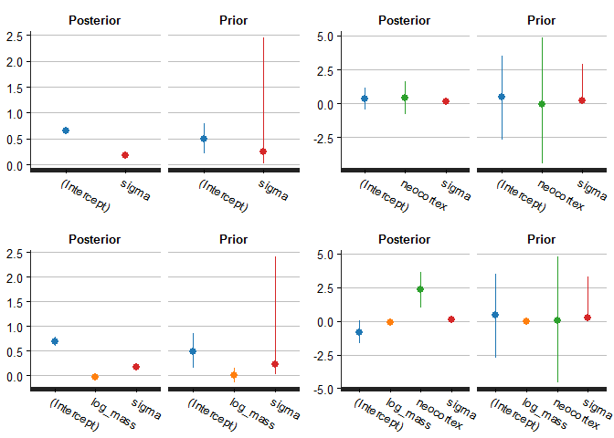

06 - Information Criteria
================
Tristan Mahr
June 29, 2016

``` r
# devtools::install_github("rmcelreath/rethinking")
library("dplyr", warn.conflicts = FALSE)
#> Warning: package 'dplyr' was built under R version 3.3.1
library("rstanarm")
#> Warning: package 'rstanarm' was built under R version 3.3.1
#> Loading required package: Rcpp
#> rstanarm (Version 2.10.1, packaged: 2016-06-24 17:54:22 UTC)
#> - Do not expect the default priors to remain the same in future rstanarm versions.
#> Thus, R scripts should specify priors explicitly, even if they are just the defaults.
#> - For execution on a local, multicore CPU with excess RAM we recommend calling
#> options(mc.cores = parallel::detectCores())
library("ggplot2")
# options(mc.cores = parallel::detectCores())

# I don't load the rethinking package, but I use the data from it.
rethinking_info <- packageDescription(
  pkg = "rethinking", 
  fields = c("Version", "GithubUsername", "GithubRepo", 
             "GithubRef", "GithubSHA1"))
str(rethinking_info, give.attr = FALSE)
#> List of 5
#>  $ Version       : chr "1.59"
#>  $ GithubUsername: chr "rmcelreath"
#>  $ GithubRepo    : chr "rethinking"
#>  $ GithubRef     : chr "master"
#>  $ GithubSHA1    : chr "a309712d904d1db7af1e08a76c521ab994006fd5"
```

6.5 Using Information Criteria
------------------------------

Get the primate milk data. The example models will predict the kilocalories per gram of milk using the mass of the mother (log kg) and the proportion of the brain that is neocortex.

``` r
data(milk, package = "rethinking")
d <- milk %>% 
  as_data_frame %>% 
  filter(!is.na(neocortex.perc)) %>% 
  mutate(neocortex = neocortex.perc / 100,
         log_mass = log(mass)) %>% 
  select(clade, species, kcal.per.g, mass, log_mass, neocortex)
d %>% knitr::kable(digits = 3)
```

| clade            | species                 |  kcal.per.g|   mass|  log\_mass|  neocortex|
|:-----------------|:------------------------|-----------:|------:|----------:|----------:|
| Strepsirrhine    | Eulemur fulvus          |        0.49|   1.95|      0.668|      0.552|
| New World Monkey | Alouatta seniculus      |        0.47|   5.25|      1.658|      0.645|
| New World Monkey | A palliata              |        0.56|   5.37|      1.681|      0.645|
| New World Monkey | Cebus apella            |        0.89|   2.51|      0.920|      0.676|
| New World Monkey | S sciureus              |        0.92|   0.68|     -0.386|      0.688|
| New World Monkey | Cebuella pygmaea        |        0.80|   0.12|     -2.120|      0.588|
| New World Monkey | Callimico goeldii       |        0.46|   0.47|     -0.755|      0.617|
| New World Monkey | Callithrix jacchus      |        0.71|   0.32|     -1.139|      0.603|
| Old World Monkey | Miopithecus talpoin     |        0.68|   1.55|      0.438|      0.700|
| Old World Monkey | M mulatta               |        0.97|   3.24|      1.176|      0.704|
| Old World Monkey | Papio spp               |        0.84|  12.30|      2.510|      0.734|
| Ape              | Hylobates lar           |        0.62|   5.37|      1.681|      0.675|
| Ape              | Pongo pygmaeus          |        0.54|  35.48|      3.569|      0.713|
| Ape              | Gorilla gorilla gorilla |        0.49|  79.43|      4.375|      0.726|
| Ape              | Pan paniscus            |        0.48|  40.74|      3.707|      0.702|
| Ape              | P troglodytes           |        0.55|  33.11|      3.500|      0.763|
| Ape              | Homo sapiens            |        0.71|  54.95|      4.006|      0.755|

I fit the models using RStanArm, and not the functions provided by the rethinking package, so I am not using the same priors as the book.

Fit the models.

``` r
# Intercept only
m1 <- stan_glm(
  formula = kcal.per.g ~ 1,
  data = d,
  family = gaussian(),
  prior = normal(0, 1),
  prior_intercept = normal(.5, .5),
  prior_ops = prior_options(prior_scale_for_dispersion = .25)
)
#> 
#> SAMPLING FOR MODEL 'continuous' NOW (CHAIN 1).
#> 
#> Chain 1, Iteration:    1 / 2000 [  0%]  (Warmup)
#> Chain 1, Iteration:  200 / 2000 [ 10%]  (Warmup)
#> Chain 1, Iteration:  400 / 2000 [ 20%]  (Warmup)
#> Chain 1, Iteration:  600 / 2000 [ 30%]  (Warmup)
#> Chain 1, Iteration:  800 / 2000 [ 40%]  (Warmup)
#> Chain 1, Iteration: 1000 / 2000 [ 50%]  (Warmup)
#> Chain 1, Iteration: 1001 / 2000 [ 50%]  (Sampling)
#> Chain 1, Iteration: 1200 / 2000 [ 60%]  (Sampling)
#> Chain 1, Iteration: 1400 / 2000 [ 70%]  (Sampling)
#> Chain 1, Iteration: 1600 / 2000 [ 80%]  (Sampling)
#> Chain 1, Iteration: 1800 / 2000 [ 90%]  (Sampling)
#> Chain 1, Iteration: 2000 / 2000 [100%]  (Sampling)
#>  Elapsed Time: 0.02 seconds (Warm-up)
#>                0.022 seconds (Sampling)
#>                0.042 seconds (Total)
#> 
#> 
#> SAMPLING FOR MODEL 'continuous' NOW (CHAIN 2).
#> 
#> Chain 2, Iteration:    1 / 2000 [  0%]  (Warmup)
#> Chain 2, Iteration:  200 / 2000 [ 10%]  (Warmup)
#> Chain 2, Iteration:  400 / 2000 [ 20%]  (Warmup)
#> Chain 2, Iteration:  600 / 2000 [ 30%]  (Warmup)
#> Chain 2, Iteration:  800 / 2000 [ 40%]  (Warmup)
#> Chain 2, Iteration: 1000 / 2000 [ 50%]  (Warmup)
#> Chain 2, Iteration: 1001 / 2000 [ 50%]  (Sampling)
#> Chain 2, Iteration: 1200 / 2000 [ 60%]  (Sampling)
#> Chain 2, Iteration: 1400 / 2000 [ 70%]  (Sampling)
#> Chain 2, Iteration: 1600 / 2000 [ 80%]  (Sampling)
#> Chain 2, Iteration: 1800 / 2000 [ 90%]  (Sampling)
#> Chain 2, Iteration: 2000 / 2000 [100%]  (Sampling)
#>  Elapsed Time: 0.019 seconds (Warm-up)
#>                0.024 seconds (Sampling)
#>                0.043 seconds (Total)
#> 
#> 
#> SAMPLING FOR MODEL 'continuous' NOW (CHAIN 3).
#> 
#> Chain 3, Iteration:    1 / 2000 [  0%]  (Warmup)
#> Chain 3, Iteration:  200 / 2000 [ 10%]  (Warmup)
#> Chain 3, Iteration:  400 / 2000 [ 20%]  (Warmup)
#> Chain 3, Iteration:  600 / 2000 [ 30%]  (Warmup)
#> Chain 3, Iteration:  800 / 2000 [ 40%]  (Warmup)
#> Chain 3, Iteration: 1000 / 2000 [ 50%]  (Warmup)
#> Chain 3, Iteration: 1001 / 2000 [ 50%]  (Sampling)
#> Chain 3, Iteration: 1200 / 2000 [ 60%]  (Sampling)
#> Chain 3, Iteration: 1400 / 2000 [ 70%]  (Sampling)
#> Chain 3, Iteration: 1600 / 2000 [ 80%]  (Sampling)
#> Chain 3, Iteration: 1800 / 2000 [ 90%]  (Sampling)
#> Chain 3, Iteration: 2000 / 2000 [100%]  (Sampling)
#>  Elapsed Time: 0.02 seconds (Warm-up)
#>                0.023 seconds (Sampling)
#>                0.043 seconds (Total)
#> 
#> 
#> SAMPLING FOR MODEL 'continuous' NOW (CHAIN 4).
#> 
#> Chain 4, Iteration:    1 / 2000 [  0%]  (Warmup)
#> Chain 4, Iteration:  200 / 2000 [ 10%]  (Warmup)
#> Chain 4, Iteration:  400 / 2000 [ 20%]  (Warmup)
#> Chain 4, Iteration:  600 / 2000 [ 30%]  (Warmup)
#> Chain 4, Iteration:  800 / 2000 [ 40%]  (Warmup)
#> Chain 4, Iteration: 1000 / 2000 [ 50%]  (Warmup)
#> Chain 4, Iteration: 1001 / 2000 [ 50%]  (Sampling)
#> Chain 4, Iteration: 1200 / 2000 [ 60%]  (Sampling)
#> Chain 4, Iteration: 1400 / 2000 [ 70%]  (Sampling)
#> Chain 4, Iteration: 1600 / 2000 [ 80%]  (Sampling)
#> Chain 4, Iteration: 1800 / 2000 [ 90%]  (Sampling)
#> Chain 4, Iteration: 2000 / 2000 [100%]  (Sampling)
#>  Elapsed Time: 0.02 seconds (Warm-up)
#>                0.024 seconds (Sampling)
#>                0.044 seconds (Total)

# One predictor
m2 <- update(m1, . ~ neocortex)
#> 
#> SAMPLING FOR MODEL 'continuous' NOW (CHAIN 1).
#> 
#> Chain 1, Iteration:    1 / 2000 [  0%]  (Warmup)
#> Chain 1, Iteration:  200 / 2000 [ 10%]  (Warmup)
#> Chain 1, Iteration:  400 / 2000 [ 20%]  (Warmup)
#> Chain 1, Iteration:  600 / 2000 [ 30%]  (Warmup)
#> Chain 1, Iteration:  800 / 2000 [ 40%]  (Warmup)
#> Chain 1, Iteration: 1000 / 2000 [ 50%]  (Warmup)
#> Chain 1, Iteration: 1001 / 2000 [ 50%]  (Sampling)
#> Chain 1, Iteration: 1200 / 2000 [ 60%]  (Sampling)
#> Chain 1, Iteration: 1400 / 2000 [ 70%]  (Sampling)
#> Chain 1, Iteration: 1600 / 2000 [ 80%]  (Sampling)
#> Chain 1, Iteration: 1800 / 2000 [ 90%]  (Sampling)
#> Chain 1, Iteration: 2000 / 2000 [100%]  (Sampling)
#>  Elapsed Time: 0.043 seconds (Warm-up)
#>                0.041 seconds (Sampling)
#>                0.084 seconds (Total)
#> 
#> 
#> SAMPLING FOR MODEL 'continuous' NOW (CHAIN 2).
#> 
#> Chain 2, Iteration:    1 / 2000 [  0%]  (Warmup)
#> Chain 2, Iteration:  200 / 2000 [ 10%]  (Warmup)
#> Chain 2, Iteration:  400 / 2000 [ 20%]  (Warmup)
#> Chain 2, Iteration:  600 / 2000 [ 30%]  (Warmup)
#> Chain 2, Iteration:  800 / 2000 [ 40%]  (Warmup)
#> Chain 2, Iteration: 1000 / 2000 [ 50%]  (Warmup)
#> Chain 2, Iteration: 1001 / 2000 [ 50%]  (Sampling)
#> Chain 2, Iteration: 1200 / 2000 [ 60%]  (Sampling)
#> Chain 2, Iteration: 1400 / 2000 [ 70%]  (Sampling)
#> Chain 2, Iteration: 1600 / 2000 [ 80%]  (Sampling)
#> Chain 2, Iteration: 1800 / 2000 [ 90%]  (Sampling)
#> Chain 2, Iteration: 2000 / 2000 [100%]  (Sampling)
#>  Elapsed Time: 0.041 seconds (Warm-up)
#>                0.042 seconds (Sampling)
#>                0.083 seconds (Total)
#> 
#> 
#> SAMPLING FOR MODEL 'continuous' NOW (CHAIN 3).
#> 
#> Chain 3, Iteration:    1 / 2000 [  0%]  (Warmup)
#> Chain 3, Iteration:  200 / 2000 [ 10%]  (Warmup)
#> Chain 3, Iteration:  400 / 2000 [ 20%]  (Warmup)
#> Chain 3, Iteration:  600 / 2000 [ 30%]  (Warmup)
#> Chain 3, Iteration:  800 / 2000 [ 40%]  (Warmup)
#> Chain 3, Iteration: 1000 / 2000 [ 50%]  (Warmup)
#> Chain 3, Iteration: 1001 / 2000 [ 50%]  (Sampling)
#> Chain 3, Iteration: 1200 / 2000 [ 60%]  (Sampling)
#> Chain 3, Iteration: 1400 / 2000 [ 70%]  (Sampling)
#> Chain 3, Iteration: 1600 / 2000 [ 80%]  (Sampling)
#> Chain 3, Iteration: 1800 / 2000 [ 90%]  (Sampling)
#> Chain 3, Iteration: 2000 / 2000 [100%]  (Sampling)
#>  Elapsed Time: 0.043 seconds (Warm-up)
#>                0.043 seconds (Sampling)
#>                0.086 seconds (Total)
#> 
#> 
#> SAMPLING FOR MODEL 'continuous' NOW (CHAIN 4).
#> 
#> Chain 4, Iteration:    1 / 2000 [  0%]  (Warmup)
#> Chain 4, Iteration:  200 / 2000 [ 10%]  (Warmup)
#> Chain 4, Iteration:  400 / 2000 [ 20%]  (Warmup)
#> Chain 4, Iteration:  600 / 2000 [ 30%]  (Warmup)
#> Chain 4, Iteration:  800 / 2000 [ 40%]  (Warmup)
#> Chain 4, Iteration: 1000 / 2000 [ 50%]  (Warmup)
#> Chain 4, Iteration: 1001 / 2000 [ 50%]  (Sampling)
#> Chain 4, Iteration: 1200 / 2000 [ 60%]  (Sampling)
#> Chain 4, Iteration: 1400 / 2000 [ 70%]  (Sampling)
#> Chain 4, Iteration: 1600 / 2000 [ 80%]  (Sampling)
#> Chain 4, Iteration: 1800 / 2000 [ 90%]  (Sampling)
#> Chain 4, Iteration: 2000 / 2000 [100%]  (Sampling)
#>  Elapsed Time: 0.04 seconds (Warm-up)
#>                0.046 seconds (Sampling)
#>                0.086 seconds (Total)
m3 <- update(m1, . ~ log_mass)
#> 
#> SAMPLING FOR MODEL 'continuous' NOW (CHAIN 1).
#> 
#> Chain 1, Iteration:    1 / 2000 [  0%]  (Warmup)
#> Chain 1, Iteration:  200 / 2000 [ 10%]  (Warmup)
#> Chain 1, Iteration:  400 / 2000 [ 20%]  (Warmup)
#> Chain 1, Iteration:  600 / 2000 [ 30%]  (Warmup)
#> Chain 1, Iteration:  800 / 2000 [ 40%]  (Warmup)
#> Chain 1, Iteration: 1000 / 2000 [ 50%]  (Warmup)
#> Chain 1, Iteration: 1001 / 2000 [ 50%]  (Sampling)
#> Chain 1, Iteration: 1200 / 2000 [ 60%]  (Sampling)
#> Chain 1, Iteration: 1400 / 2000 [ 70%]  (Sampling)
#> Chain 1, Iteration: 1600 / 2000 [ 80%]  (Sampling)
#> Chain 1, Iteration: 1800 / 2000 [ 90%]  (Sampling)
#> Chain 1, Iteration: 2000 / 2000 [100%]  (Sampling)
#>  Elapsed Time: 0.042 seconds (Warm-up)
#>                0.036 seconds (Sampling)
#>                0.078 seconds (Total)
#> 
#> 
#> SAMPLING FOR MODEL 'continuous' NOW (CHAIN 2).
#> 
#> Chain 2, Iteration:    1 / 2000 [  0%]  (Warmup)
#> Chain 2, Iteration:  200 / 2000 [ 10%]  (Warmup)
#> Chain 2, Iteration:  400 / 2000 [ 20%]  (Warmup)
#> Chain 2, Iteration:  600 / 2000 [ 30%]  (Warmup)
#> Chain 2, Iteration:  800 / 2000 [ 40%]  (Warmup)
#> Chain 2, Iteration: 1000 / 2000 [ 50%]  (Warmup)
#> Chain 2, Iteration: 1001 / 2000 [ 50%]  (Sampling)
#> Chain 2, Iteration: 1200 / 2000 [ 60%]  (Sampling)
#> Chain 2, Iteration: 1400 / 2000 [ 70%]  (Sampling)
#> Chain 2, Iteration: 1600 / 2000 [ 80%]  (Sampling)
#> Chain 2, Iteration: 1800 / 2000 [ 90%]  (Sampling)
#> Chain 2, Iteration: 2000 / 2000 [100%]  (Sampling)
#>  Elapsed Time: 0.041 seconds (Warm-up)
#>                0.039 seconds (Sampling)
#>                0.08 seconds (Total)
#> 
#> 
#> SAMPLING FOR MODEL 'continuous' NOW (CHAIN 3).
#> 
#> Chain 3, Iteration:    1 / 2000 [  0%]  (Warmup)
#> Chain 3, Iteration:  200 / 2000 [ 10%]  (Warmup)
#> Chain 3, Iteration:  400 / 2000 [ 20%]  (Warmup)
#> Chain 3, Iteration:  600 / 2000 [ 30%]  (Warmup)
#> Chain 3, Iteration:  800 / 2000 [ 40%]  (Warmup)
#> Chain 3, Iteration: 1000 / 2000 [ 50%]  (Warmup)
#> Chain 3, Iteration: 1001 / 2000 [ 50%]  (Sampling)
#> Chain 3, Iteration: 1200 / 2000 [ 60%]  (Sampling)
#> Chain 3, Iteration: 1400 / 2000 [ 70%]  (Sampling)
#> Chain 3, Iteration: 1600 / 2000 [ 80%]  (Sampling)
#> Chain 3, Iteration: 1800 / 2000 [ 90%]  (Sampling)
#> Chain 3, Iteration: 2000 / 2000 [100%]  (Sampling)
#>  Elapsed Time: 0.04 seconds (Warm-up)
#>                0.043 seconds (Sampling)
#>                0.083 seconds (Total)
#> 
#> 
#> SAMPLING FOR MODEL 'continuous' NOW (CHAIN 4).
#> 
#> Chain 4, Iteration:    1 / 2000 [  0%]  (Warmup)
#> Chain 4, Iteration:  200 / 2000 [ 10%]  (Warmup)
#> Chain 4, Iteration:  400 / 2000 [ 20%]  (Warmup)
#> Chain 4, Iteration:  600 / 2000 [ 30%]  (Warmup)
#> Chain 4, Iteration:  800 / 2000 [ 40%]  (Warmup)
#> Chain 4, Iteration: 1000 / 2000 [ 50%]  (Warmup)
#> Chain 4, Iteration: 1001 / 2000 [ 50%]  (Sampling)
#> Chain 4, Iteration: 1200 / 2000 [ 60%]  (Sampling)
#> Chain 4, Iteration: 1400 / 2000 [ 70%]  (Sampling)
#> Chain 4, Iteration: 1600 / 2000 [ 80%]  (Sampling)
#> Chain 4, Iteration: 1800 / 2000 [ 90%]  (Sampling)
#> Chain 4, Iteration: 2000 / 2000 [100%]  (Sampling)
#>  Elapsed Time: 0.042 seconds (Warm-up)
#>                0.041 seconds (Sampling)
#>                0.083 seconds (Total)

# Two predictors
m4 <- update(m1, . ~ neocortex + log_mass)
#> 
#> SAMPLING FOR MODEL 'continuous' NOW (CHAIN 1).
#> 
#> Chain 1, Iteration:    1 / 2000 [  0%]  (Warmup)
#> Chain 1, Iteration:  200 / 2000 [ 10%]  (Warmup)
#> Chain 1, Iteration:  400 / 2000 [ 20%]  (Warmup)
#> Chain 1, Iteration:  600 / 2000 [ 30%]  (Warmup)
#> Chain 1, Iteration:  800 / 2000 [ 40%]  (Warmup)
#> Chain 1, Iteration: 1000 / 2000 [ 50%]  (Warmup)
#> Chain 1, Iteration: 1001 / 2000 [ 50%]  (Sampling)
#> Chain 1, Iteration: 1200 / 2000 [ 60%]  (Sampling)
#> Chain 1, Iteration: 1400 / 2000 [ 70%]  (Sampling)
#> Chain 1, Iteration: 1600 / 2000 [ 80%]  (Sampling)
#> Chain 1, Iteration: 1800 / 2000 [ 90%]  (Sampling)
#> Chain 1, Iteration: 2000 / 2000 [100%]  (Sampling)
#>  Elapsed Time: 0.061 seconds (Warm-up)
#>                0.067 seconds (Sampling)
#>                0.128 seconds (Total)
#> 
#> 
#> SAMPLING FOR MODEL 'continuous' NOW (CHAIN 2).
#> 
#> Chain 2, Iteration:    1 / 2000 [  0%]  (Warmup)
#> Chain 2, Iteration:  200 / 2000 [ 10%]  (Warmup)
#> Chain 2, Iteration:  400 / 2000 [ 20%]  (Warmup)
#> Chain 2, Iteration:  600 / 2000 [ 30%]  (Warmup)
#> Chain 2, Iteration:  800 / 2000 [ 40%]  (Warmup)
#> Chain 2, Iteration: 1000 / 2000 [ 50%]  (Warmup)
#> Chain 2, Iteration: 1001 / 2000 [ 50%]  (Sampling)
#> Chain 2, Iteration: 1200 / 2000 [ 60%]  (Sampling)
#> Chain 2, Iteration: 1400 / 2000 [ 70%]  (Sampling)
#> Chain 2, Iteration: 1600 / 2000 [ 80%]  (Sampling)
#> Chain 2, Iteration: 1800 / 2000 [ 90%]  (Sampling)
#> Chain 2, Iteration: 2000 / 2000 [100%]  (Sampling)
#>  Elapsed Time: 0.067 seconds (Warm-up)
#>                0.058 seconds (Sampling)
#>                0.125 seconds (Total)
#> 
#> 
#> SAMPLING FOR MODEL 'continuous' NOW (CHAIN 3).
#> 
#> Chain 3, Iteration:    1 / 2000 [  0%]  (Warmup)
#> Chain 3, Iteration:  200 / 2000 [ 10%]  (Warmup)
#> Chain 3, Iteration:  400 / 2000 [ 20%]  (Warmup)
#> Chain 3, Iteration:  600 / 2000 [ 30%]  (Warmup)
#> Chain 3, Iteration:  800 / 2000 [ 40%]  (Warmup)
#> Chain 3, Iteration: 1000 / 2000 [ 50%]  (Warmup)
#> Chain 3, Iteration: 1001 / 2000 [ 50%]  (Sampling)
#> Chain 3, Iteration: 1200 / 2000 [ 60%]  (Sampling)
#> Chain 3, Iteration: 1400 / 2000 [ 70%]  (Sampling)
#> Chain 3, Iteration: 1600 / 2000 [ 80%]  (Sampling)
#> Chain 3, Iteration: 1800 / 2000 [ 90%]  (Sampling)
#> Chain 3, Iteration: 2000 / 2000 [100%]  (Sampling)
#>  Elapsed Time: 0.069 seconds (Warm-up)
#>                0.068 seconds (Sampling)
#>                0.137 seconds (Total)
#> 
#> 
#> SAMPLING FOR MODEL 'continuous' NOW (CHAIN 4).
#> 
#> Chain 4, Iteration:    1 / 2000 [  0%]  (Warmup)
#> Chain 4, Iteration:  200 / 2000 [ 10%]  (Warmup)
#> Chain 4, Iteration:  400 / 2000 [ 20%]  (Warmup)
#> Chain 4, Iteration:  600 / 2000 [ 30%]  (Warmup)
#> Chain 4, Iteration:  800 / 2000 [ 40%]  (Warmup)
#> Chain 4, Iteration: 1000 / 2000 [ 50%]  (Warmup)
#> Chain 4, Iteration: 1001 / 2000 [ 50%]  (Sampling)
#> Chain 4, Iteration: 1200 / 2000 [ 60%]  (Sampling)
#> Chain 4, Iteration: 1400 / 2000 [ 70%]  (Sampling)
#> Chain 4, Iteration: 1600 / 2000 [ 80%]  (Sampling)
#> Chain 4, Iteration: 1800 / 2000 [ 90%]  (Sampling)
#> Chain 4, Iteration: 2000 / 2000 [100%]  (Sampling)
#>  Elapsed Time: 0.063 seconds (Warm-up)
#>                0.061 seconds (Sampling)
#>                0.124 seconds (Total)
```

Compare posterior to prior in each model.

``` r
# Want to have same colors for parameters across plots, so manually set colors
# so that intercept gets first color, sigma fourth color, etc.
d3_colors <- c("#1f77b4", "#ff7f0e", "#2ca02c", "#d62728", "#9467bd", 
               "#8c564b", "#e377c2", "#7f7f7f", "#bcbd22", "#17becf")
p1 <- posterior_vs_prior(m1) + scale_color_manual(values = d3_colors[c(1, 4)])
#> 
#> Drawing from prior...
#> 
#>  Elapsed Time: 0.02 seconds (Warm-up)
#>                0.023 seconds (Sampling)
#>                0.043 seconds (Total)
#> 
#> 
#>  Elapsed Time: 0.019 seconds (Warm-up)
#>                0.028 seconds (Sampling)
#>                0.047 seconds (Total)
p2 <- posterior_vs_prior(m2) + scale_color_manual(values = d3_colors[c(1, 3:4)])
#> 
#> Drawing from prior...
#> 
#>  Elapsed Time: 0.043 seconds (Warm-up)
#>                0.039 seconds (Sampling)
#>                0.082 seconds (Total)
#> 
#> 
#>  Elapsed Time: 0.043 seconds (Warm-up)
#>                0.041 seconds (Sampling)
#>                0.084 seconds (Total)
p3 <- posterior_vs_prior(m3) + scale_color_manual(values = d3_colors[c(1:2, 4)])
#> 
#> Drawing from prior...
#> 
#>  Elapsed Time: 0.039 seconds (Warm-up)
#>                0.039 seconds (Sampling)
#>                0.078 seconds (Total)
#> 
#> 
#>  Elapsed Time: 0.041 seconds (Warm-up)
#>                0.041 seconds (Sampling)
#>                0.082 seconds (Total)
p4 <- posterior_vs_prior(m4) + scale_color_manual(values = d3_colors[c(1:4)])
#> 
#> Drawing from prior...
#> 
#>  Elapsed Time: 0.048 seconds (Warm-up)
#>                0.049 seconds (Sampling)
#>                0.097 seconds (Total)
#> 
#> 
#>  Elapsed Time: 0.048 seconds (Warm-up)
#>                0.045 seconds (Sampling)
#>                0.093 seconds (Total)
cowplot::plot_grid(p1, p2, p3, p4)
```



Get the WAIC using the loo package.

I'm going to experiment with many-models, dataframe-of-models technique here. That means doing some unconventional things with dataframes.

Basically, I make a data-frame with one row per model and then do things to each model, storing the results of those operations as new columns in the dataframe. Specifically, I calculate the WAIC of the Stan models and refit the models using the classical technique so I can get an AIC value to compare to the WAIC value.

``` r
library("tidyr")
library("purrr")
#> 
#> Attaching package: 'purrr'
#> The following objects are masked from 'package:dplyr':
#> 
#>     contains, order_by

# Refit a stanreg model using lm
as_lm <- function(stan_model) {
  lm(stan_model$formula, stan_model$data )
}

# Get a dataframe summary from a loo::waic object
tidy_waic <- function(waic_fit) {
  to_keep <- c("waic", "se_waic", "elpd_waic", "se_elpd_waic", 
               "p_waic", "se_p_waic")
  ret <- waic_fit[to_keep]
  as_data_frame(ret)
}

# Create a dataframe with one-row per model
model_summary <- data_frame(StanFit = list(m1, m2, m3, m4)) %>% 
  mutate(
    # Use the formula from the model as a label
    Formula = map_chr(StanFit, ~ .x$formula %>% deparse),
    # Get the classical fit and deviance/AIC of classical fit
    ClassicalFit = map(StanFit, as_lm),
    Deviance = map_dbl(ClassicalFit, ~ logLik(.x) * -2),
    AIC = map_dbl(ClassicalFit, AIC),
    # Get the WAIC summary from the Stan fit of the model
    WAIC = map(StanFit, . %>% loo::waic() %>% tidy_waic)) %>% 
  # The WAIC is stored as a dataframe within each row. Unnest to promote the
  # columns from the nested dataframe
  unnest(WAIC)

# We need to exclude the list columns in order to print a formatted table 
model_summary %>% 
  select(-StanFit, -ClassicalFit) %>% 
  arrange(waic) %>% 
  knitr::kable(, digits = 2) 
```

| Formula                            |  Deviance|     AIC|    waic|  se\_waic|  elpd\_waic|  se\_elpd\_waic|  p\_waic|  se\_p\_waic|
|:-----------------------------------|---------:|-------:|-------:|---------:|-----------:|---------------:|--------:|------------:|
| kcal.per.g ~ neocortex + log\_mass |    -25.36|  -17.36|  -17.46|      5.02|        8.73|            2.51|     2.74|         0.73|
| kcal.per.g ~ log\_mass             |    -14.74|   -8.74|   -9.34|      4.38|        4.67|            2.19|     1.90|         0.42|
| kcal.per.g ~ 1                     |    -12.46|   -8.46|   -8.97|      4.05|        4.49|            2.02|     1.28|         0.32|
| kcal.per.g ~ neocortex             |    -12.87|   -6.87|   -7.76|      3.62|        3.88|            1.81|     1.81|         0.31|
